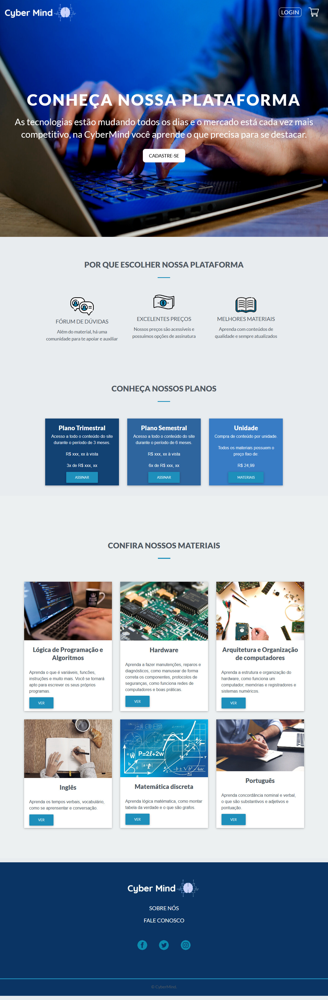

# André Luís da Silva e Silva

# Tabela de conteúdo
   - [Em 2020-2 (CyberMind) 1º Semestre](#em-2020-2-Cybermind-1º-semestre)
        - [Empresa](#empresa)
        - [Problema](#problema)
        - [Solução](#solução)
        - [Site](#site)
        - [Tecnologias utilizadas](#tecnologias-utilizadas)
        - [Contribuições Pessoais](#contribuições-pessoais)
            - [Hard Skills](#hard-skills)
            - [Soft Skills](#soft-skills)

# Em 2020-2 (CyberMind) 1º Semestre
[Github Cyber Mind](https://github.com/AndreSilva358/api-cybermind)

## Empresa

No primeiro semestre não houve uma empresa, os projetos foram definidos pelas equipes.

## Problema

Desenvolver um site de e-commerce no qual os alunos pudessem acessar conteúdos didáticos de qualidade, fomentando a cultura e agregando valores ao cliente de acordo com as regras de negócios. O site tinha como objetivo proporcionar uma melhor experiência ao usuário, para que o aprendizado fosse efetivo. 

## Solução

   Para isso, elaboramos um site utilizando técnicas de usuabilidade e responsividade, para que independentemente de qual dispositivo realiza o acesso a ele, a performance seja sempre a mesma. Além disso, optamos por um design moderno e minimalista, sendo azul e branco as cores predominantes, já que estão relacionadas a educação.

### Site

    

## Tecnologias Utilizadas
- HTML5  \
Linguagem de programação.
- CSS3 \
Linguagem de folhas de estilos.
- JavaScript \
Linguagem de programação.
- Bootstrap \
Framework web
- PHP  \
Linguagem de programação.
- MySQL \
Sistema de gerenciamento de banco de dados
- CamStudio \
Programa para edição e gravação de vídeos

## Contribuições Pessoais

### Hard Skills
- HTML5, CSS3: Sei fazer com ajuda.
- Python: Sei fazer com autonomia.
- Javascript: Sei fazer com autonomia.

### Soft Skills
- Proatividade

    Percebi que poderíamos ter dificuldades em relação ao desenvolvimento dos materiais didáticos, especialmente no que dizia respeito ao material de inglês, que é algo que domino. Portanto, me ofereci para formular o material em questão, além de gravar as videoaulas necessárias para o site.

- Trabalho em equipe

    Quando um membro da equipe começou a ter dificuldades, me ofereci para ajudá-lo, levando em consideração o problema em questão eu estava confiante de que não haveriam problemas.    

